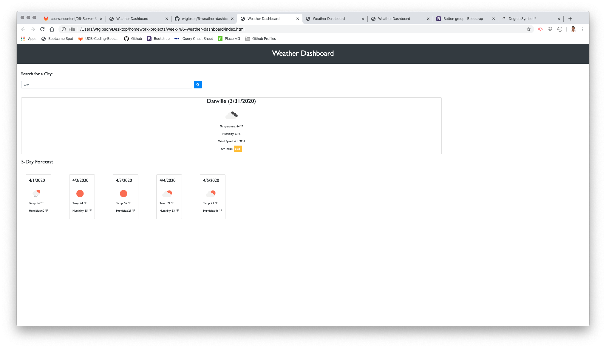

# 06 Server-Side APIs: Weather Dashboard

## Summary 

The purpose of the assignment was to create a web application featuring a weather dashboard which leveraged the OpenWeather API to retrieve data dynamically updated based on the user's city search input.

```
User Story

AS A traveler
I WANT to see the weather outlook for multiple cities
SO THAT I can plan a trip accordingly

Acceptance Criteria

GIVEN a weather dashboard with form inputs
WHEN I search for a city
THEN I am presented with current and future conditions for that city and that city is added to the search history
WHEN I view current weather conditions for that city
THEN I am presented with the city name, the date, an icon representation of weather conditions, the temperature, the humidity, the wind speed, and the UV index
WHEN I view the UV index
THEN I am presented with a color that indicates whether the conditions are favorable, moderate, or severe
WHEN I view future weather conditions for that city
THEN I am presented with a 5-day forecast that displays the date, an icon representation of weather conditions, the temperature, and the humidity
WHEN I click on a city in the search history
THEN I am again presented with current and future conditions for that city
```

## Site Picture


## Technologies Used
- HTML - used to create elements on the DOM
- CSS - styles HTML elements on page
- Bootstrap - CSS framework directed at responsive, mobile first front-end web development
- JavaScript - provides dynamic interactivity on HTML documents
- jQuery - easy to use API library simplifying Javascript actions
- Server-Side API - utilized 3rd-party application APIs to retrieve data to incorporate into the site
- Git - version control system to track changes to source code
- GitHub - hosts repository that can be deployed to GitHub Pages

## Code Snippet

Below is an example of a block of code in the JS file where the information for the 5-Day Forecast is retireved via an AJAX call and appended to the page dynamically based on the user's actions.

```js
function fiveDayForecast(city) {
  
  
  var forecastQuery = "http://api.openweathermap.org/data/2.5/forecast?q=" + city + "&appid=" + apiKey;

  $.ajax({
    url: forecastQuery,
    method: "GET"
  }).then(function (response) {
    forecastData = response;
    console.log(forecastData)
    
    showForecast(forecastData)

  });
};

function showForecast(forecastData) {

  for (var i = 0; i < 5; i++) {
    console.log(i)

    var dataIndex = forecastData.list[i * 8 + 4];

    var utcSeconds = dataIndex.dt;
    var date = new Date(0);
    date.setUTCSeconds(utcSeconds);
    date = date.toLocaleDateString("en-US");

    var Fahrenheit = Math.round((dataIndex.main.temp * 9) / 5 - 459.67);

    var cardID = $("#" + i);
    cardID.html("<h4>" + date + "<h4>");
    cardID.append('');
    cardID.append("<p>Temp: " + Fahrenheit + " ℉</p>")
    cardID.append("<p>Humidity: " + dataIndex.main.humidity + " ℉</p>")

  };
};
```

## Author Links

Will Gibson

[LinkedIn](https://www.linkedin.com/in/wtgibson/)

[GitHub](https://github.com/wtgibson/6-weather-dashboard)

Special thanks to Mahisha Gunasekaran, Kerwin Hy, and Jeremy Cantwell for their input and assistance with the assignment!